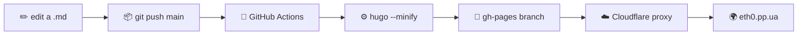

<div align="center">

# `eth0.pp.ua`

### a tiny corner of the internet for one sysadmin from 🇺🇦

[](https://gohugo.io/)
[](https://github.com/adityatelange/hugo-PaperMod)
[](https://pages.github.com/)
[](https://www.cloudflare.com/)
[](https://github.com/evgeniyme/eth0.pp.ua/actions/workflows/deploy.yml)

[**🌐 eth0.pp.ua**](https://eth0.pp.ua) &nbsp;·&nbsp;
[**📄 CV**](https://eth0.pp.ua/posts/cv/) &nbsp;·&nbsp;
[**💼 LinkedIn**](https://www.linkedin.com/in/yevhenii-vasiutenko-503566202)

</div>

---

## What is this?

A static blog/CV site written in Markdown, baked by [Hugo](https://gohugo.io/), wearing
the [PaperMod](https://github.com/adityatelange/hugo-PaperMod) theme.
No databases, no servers to babysit, no JavaScript frameworks of the week — just files and good intentions.

> _“This page is not a Site.”_ &nbsp;— the homepage, philosophically

## How it gets to the internet



Every push to `main` triggers [`.github/workflows/deploy.yml`](.github/workflows/deploy.yml),
which builds the site with Hugo and pushes the result to the `gh-pages` branch.
Cloudflare sits in front for SSL and CDN. Total deploy time: ~30 seconds.

## Local development

```bash
git clone https://github.com/evgeniyme/eth0.pp.ua.git
cd eth0.pp.ua
hugo server -D        # http://localhost:1313
```

To add a new post:

```bash
hugo new posts/hello-world.md
```

Then edit the file in `content/posts/`, commit, push — done.

## Project layout

```
.
├── .github/workflows/   # GitHub Actions: build & deploy
├── archetypes/          # post templates
├── content/             # all the words live here
│   └── posts/           # blog posts & CV
├── static/              # raw files served as-is (CNAME, images)
├── themes/PaperMod/     # the dress
└── config.yml           # the brain
```

## Stack

| Layer       | Tech                                                                   |
| :---------- | :--------------------------------------------------------------------- |
| Generator   | [Hugo](https://gohugo.io/) (extended)                                  |
| Theme       | [PaperMod](https://github.com/adityatelange/hugo-PaperMod)             |
| CI/CD       | [GitHub Actions](https://github.com/features/actions)                  |
| Hosting     | [GitHub Pages](https://pages.github.com/)                              |
| DNS / CDN   | [Cloudflare](https://www.cloudflare.com/) (Proxied, SSL Full)          |
| Mail        | [Zoho Mail](https://www.zoho.com/mail/) (`MX` records bypass proxy)    |

## License

Code is MIT-ish. Words on the site belong to the author. Steal good ideas, credit good people.

<div align="center">

— made between coffees by **[@evgeniyme](https://github.com/evgeniyme)**, somewhere between 🇺🇦 and 🇵🇹

</div>
